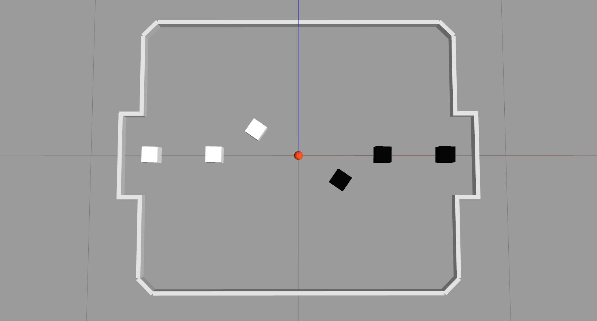

# vsss-simulator


Simulador desenvolvido com ROS e Gazebo para a equipe de robótica [Carrossel Caipira](https://carrosselcaipira.github.io/site), competidora de futebol de robôs na categoria IEEE Very Small Size Soccer ([VSSS](http://www.cbrobotica.org/?page_id=81)) da Latin American Robotics Competition (LARC).

Este simulador é um trabalho de conclusão de curso em Sistemas de Informação da UNESP/Bauru.

## Instalar ROS
http://wiki.ros.org/melodic/Installation/Ubuntu

## Instalar [Gazebo](http://gazebosim.org/tutorials?tut=install_ubuntu)
```
$ sudo apt-get install gazebo9
```

## Instalar dependências de desenvolvimento do Gazebo
```
$ sudo apt-get install libgazebo9-dev
```

## Criar pasta do simulador
```
$ mkdir ~/vsss_simulator
$ cd ~/vsss_simulator
$ git clone https://github.com/evertonkelvin/vsss-simulator.git
```

## Compilar simulador
```
$ cd ~/vsss_simulator
$ catkin_make
```

## Executar simulador

### Executar simulador completo (todos os módulos)
```
$ cd ~/vsss_simulator
$ source devel/setup.bash OR $ source devel/setup.zsh
$ roslaunch vsss_simulator.launch
```

### Executar cada módulo separadamente
* Executar módulo do Gazebo:
```
$ cd ~/vsss_simulator
$ source devel/setup.bash OR $ source devel/setup.zsh
$ roslaunch gazebo_simulator gazebo_simulator.launch
```
* Abrir outro terminal e executar módulo do Árbitro:
```
$ cd ~/vsss_simulator
$ source devel/setup.bash OR $ source devel/setup.zsh
$ roslaunch referee referee.launch
```
* Abrir outro terminal e executar módulo de Controle do Time 1:
```
$ cd ~/vsss_simulator
$ source devel/setup.bash OR $ source devel/setup.zsh
$ roslaunch team1_control team1_control.launch
```
* Abrir outro terminal e executar módulo de Controle do Time 2:
```
$ cd ~/vsss_simulator
$ source devel/setup.bash OR $ source devel/setup.zsh
$ roslaunch team2_control team2_control.launch
```